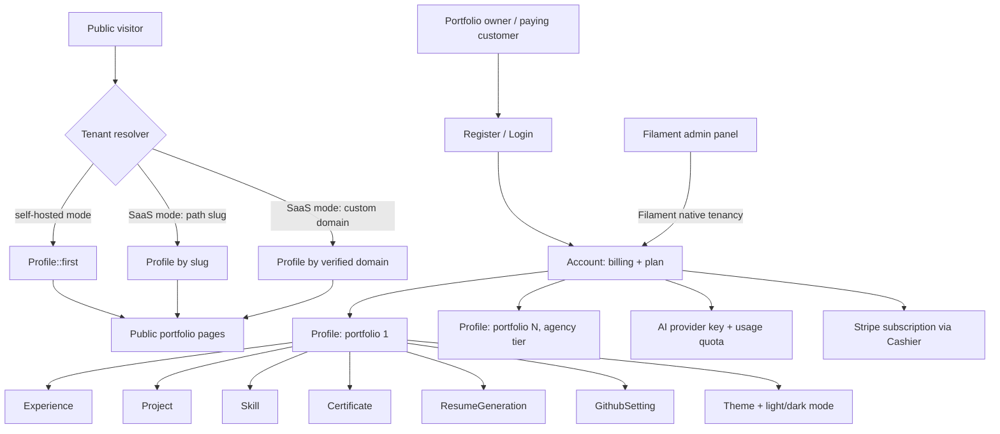

# SAAS TRANSFORMATION PLAN

Turning the single-tenant AI Portfolio Platform into a multi-tenant SaaS
(Path B), without discarding anything already built.

This is a planning document, not a changelog. It is written so each
phase can be handed to a developer (or an AI agent) as a standalone,
testable unit of work. It is preserved here **verbatim** as the
original source of truth; the `docs/agents/0N-*.md` files next to this
one split it into actionable, phase-grouped implementation guides with
notes on where the real codebase's file paths differ from what's
guessed below. When the two disagree, the `0N-*.md` guides and the
root `AGENTS.md` "Current Status" section win — this file is history,
not a live spec.

---

## GUIDING PRINCIPLES (read this before touching any code)

1. **Additive, not destructive.**
   Every model, service, and admin resource that already exists
   (Profile, Experience, Project, Skill, Certificate, ResumeGeneration,
   Template, Theme, AiSetting, GithubSetting, ResumeTailorService,
   GitHubSyncService, TemplateConversionService, ThemeService, the PDF
   templates, the Filament admin panel) stays. We are generalizing a
   singleton system into a multi-row system, not rewriting it.

2. **Keep the self-hosted / single-tenant product alive.**
   You currently have two sellable things: (a) the software itself
   (Path A, one-time sale to agencies/bootcamps who self-host it), and
   (b) a SaaS business (Path B). This plan introduces a `SAAS_MODE`
   feature flag so the exact same codebase can run in either mode.
   Don't burn Path A to build Path B.

3. **One seam, not a thousand call sites.**
   Right now, `Profile::first()` and unscoped queries against
   Experience/Project/Skill/Certificate are scattered across Volt
   components, Filament resources, and services. Rather than editing
   every call site by hand, Phase 1 introduces a single resolver
   (`CurrentProfileResolver`) that every page/service asks "which
   profile/tenant am I rendering for right now?" This is the one real
   "algorithm change": centralizing tenant resolution instead of
   threading it through the whole codebase.

4. **Ship in reversible slices.**
   Every phase below ends with a working, testable application. Run
   `php artisan test` after each phase. Add tests for the new tenancy
   boundary before moving to the next phase, not at the end.

5. **Reuse Filament's native multi-tenancy instead of hand-rolling it.**
   Filament 5 (already installed, `filament/filament: ^5.6`) has a
   built-in tenancy feature (`Panel::tenant()`) designed for exactly
   this scenario: one panel, many tenants, automatic resource scoping,
   tenant switcher UI. Use it instead of manually adding
   `->where('account_id', ...)` to every Filament resource query.

6. **Don't build a database-per-tenant system.**
   Packages like `stancl/tenancy` (separate DB/schema per tenant) are
   overkill for a resume/portfolio SaaS at this scale and add real
   operational cost (migrations run N times, backups get complicated,
   support gets harder). Use the standard "single database, shared
   schema, `account_id`/`profile_id` columns" pattern. This is simpler,
   cheaper to run, and is what nearly every bootstrapped SaaS at this
   scale actually uses.

---

## TARGET ARCHITECTURE (end state after this plan)



Key idea: `Profile` keeps its name and keeps meaning "one portfolio's
data," but it is no longer a singleton — it gets `account_id`, an owning
`user_id`, and a unique `slug`. Everything that currently hangs off "the"
profile now hangs off "a" profile.

---

## PHASE 0 — Groundwork (zero behavior change, ships in isolation)

Goal: introduce the seams that every later phase will plug into, without
changing anything a current user/visitor sees.

Tasks:
1. Add `SAAS_MODE` to `config/app.php` (or a new `config/saas.php`),
   backed by `env('SAAS_MODE', false)`. Default `false` so the existing
   single-tenant install is completely unaffected.
2. Create `App\Services\CurrentProfileResolver` with one public method:
   `resolve(): ?Profile`.
   - For now, it simply does `return Profile::first();` regardless of
     `SAAS_MODE`. This is intentional — Phase 0 changes *nothing*
     observable.
3. Replace every direct `Profile::first()` call used for "the site's
   profile" in Volt public components with a call to
   `app(CurrentProfileResolver::class)->resolve()`.
   Do NOT touch calls to `Profile::first()` inside Filament admin
   resources yet — those are handled in Phase 1 via Filament tenancy.
4. Add a feature test asserting all public routes still return 200 and
   render the same content as before.

Acceptance criteria:
- `php artisan test` passes, no visual/behavioral change.
- Every "which profile is this page about" decision now flows through
  one method, `CurrentProfileResolver::resolve()`.

Why this matters: every later phase only needs to change the inside of
this one method. Nothing downstream needs to change again.

---

## PHASE 1 — Multi-tenancy foundation

Goal: make it possible for more than one portfolio to exist in the
database at once, safely, with the existing single-tenant install's data
preserved and still fully functional.

### 1.1 New tables
- `accounts`
  - id, name, owner_user_id (FK users), stripe_customer_id (nullable),
    stripe_subscription_id (nullable), plan_slug (string, default
    'free'), trial_ends_at (nullable), timestamps.
- Add to `profiles`:
  - `account_id` (FK accounts, nullable at first for backfill safety),
  - `user_id` (FK users, the portfolio's owner/editor, nullable at
    first),
  - `slug` (string, unique, nullable at first, indexed).
- Add `profile_id` (FK profiles) to:
  - `experiences`, `projects`, `skills`, `certificates`,
    `resume_generations`, `github_settings`.
- Add `account_id` (nullable FK accounts) to `templates`
  (NULL = global/platform template visible to everyone, non-null =
  private template belonging to that account — this preserves the
  existing seeded platform templates as-is and adds room for
  tenant-uploaded ones later in Phase 7).
- Add `account_id` (FK accounts) to `ai_settings` (AI provider key and
  quota tracked per paying Account, not per Profile — one account with
  multiple profiles shares one AI budget; simpler billing story).

### 1.2 Data backfill (critical — do this carefully, on a DB backup first)
Write an idempotent Artisan command, e.g. `php artisan tenancy:backfill`:
1. If no `Account` exists yet, create one named after the existing
   `Profile`'s `full_name` (or "Default Account"), owned by the first
   `User` in the table (the existing seeded/admin user).
2. Assign that Account's id to every existing `Profile` row's
   `account_id`, and the admin `User`'s id to `user_id`.
3. Generate a `slug` for every existing Profile from `full_name` (e.g.
   `Str::slug($profile->full_name)`), guaranteeing uniqueness.
4. Backfill `profile_id` on every `Experience`, `Project`, `Skill`,
   `Certificate`, `ResumeGeneration`, `GithubSetting` row to point at
   that one existing Profile (there is currently only one, so this is
   an unambiguous 1:1 mapping).
5. Backfill `account_id` on every `AiSetting` row to point at the one
   Account.
6. Leave `templates.account_id` NULL for all existing seeded templates
   (they become the platform's global catalog).
Run this locally against a copy of the real database first. Only after
verifying row counts and spot-checking a few records, run it against
the real database, then make the backfilled columns non-nullable in a
follow-up migration.

### 1.3 Model changes
- `Profile belongsTo Account`, `Profile belongsTo User` (owner),
  `Profile hasMany Experience/Project/Skill/Certificate/
  ResumeGeneration`, `Profile hasOne GithubSetting`.
- `Account belongsTo User` (owner), `Account hasMany Profile`,
  `Account hasMany AiSetting` (usually just one active).
- Add a `BelongsToProfile` trait + Eloquent global scope for
  Experience/Project/Skill/Certificate/ResumeGeneration/GithubSetting
  that automatically constrains queries to the "current" profile
  resolved via `CurrentProfileResolver`, EXCEPT when running inside the
  Filament admin panel (where Filament's tenancy already scopes things
  explicitly — see 1.4). This keeps every existing
  `Experience::orderBy(...)->get()` style call in public Volt
  components safe by default, without editing each call site.
- Update `CurrentProfileResolver::resolve()`:
  - If `SAAS_MODE` is false: unchanged, `Profile::first()`.
  - If `SAAS_MODE` is true: resolve from the current route's `{slug}`
    parameter (wired up in Phase 3), or fall back to null if none.

### 1.4 Filament native multi-tenancy for the admin panel
- In the Filament Panel provider, call `->tenant(Account::class)`
  (Filament 5's built-in tenancy API) so:
  - Every Filament resource automatically scopes to the logged-in
    user's current Account.
  - A tenant switcher appears automatically if a user belongs to more
    than one Account (needed later for Phase 8's agency tier; harmless
    now).
- Existing Filament resources need their Eloquent queries scoped to
  the current tenant's Profile(s)/Account — Filament's tenancy feature
  handles the Account-level scoping automatically once resources
  declare their tenant relationship; Profile-level resources
  (Experience, Project, etc.) additionally need a "current Profile"
  selector if an Account ever has more than one Profile (only relevant
  starting Phase 8 — for Phases 1-7, one Account has exactly one
  Profile, so this is a non-issue in practice).

### 1.5 Acceptance criteria
- `php artisan test` passes.
- New test: create two Accounts, each with their own Profile +
  Projects. Assert Account A's admin session cannot see Account B's
  projects in Filament, and Account A's public portfolio page never
  renders Account B's data.
- Existing single-tenant install (SAAS_MODE=false) behaves byte-for-byte
  the same as before this phase.

---

## PHASE 2 — Auth, registration & onboarding

Goal: let a new person sign up and get their own portfolio, without
touching an admin's database by hand.

Tasks:
1. Add public registration (Laravel Fortify or Breeze-style controllers
   are fine — Filament 5 also ships panel-level registration
   components you can enable on the admin panel's login page instead of
   building a separate one).
2. On successful registration:
   - Create a `User`.
   - Create an `Account` owned by that user, `plan_slug = 'free'`.
   - Create a `Profile` for that Account with a system-suggested slug
     (from the user's name/email, made unique), empty/default content.
3. Build a short onboarding wizard (3-4 steps, can be a simple Livewire
   flow, reusing Volt patterns already in the codebase):
   - Step 1: choose your slug/URL (`yoursaas.com/{slug}`).
   - Step 2: basic profile info (name, headline, one-liner bio).
   - Step 3: pick a starter Theme + light/dark mode (ties into Phase 5).
   - Step 4: redirect into the Filament admin panel to fill in the
     rest, with a checklist widget ("add your first project", "connect
     GitHub", "generate your first resume").
4. Add email verification (Laravel's built-in `MustVerifyEmail`) —
   important once you're sending real transactional email at scale.

Acceptance criteria:
- A brand-new signup ends up with a working, empty, uniquely-slugged
  portfolio and can log into `/admin` and see only their own data.
- Existing admin/demo account is unaffected.

---

## PHASE 3 — Public routing overhaul + SAAS_MODE

Goal: make `/` behave as a marketing homepage in SaaS mode, and move
each tenant's portfolio under its own namespace, while the self-hosted
mode keeps working exactly as it does today.

### 3.1 Route restructuring
In `routes/web.php`:
- Wrap the existing Volt routes in a conditional based on `SAAS_MODE`:
  - `SAAS_MODE=false` (self-hosted/Path A default): routes stay exactly
    as they are today — `/`, `/about`, `/projects`, etc. at the root,
    unchanged.
  - `SAAS_MODE=true`:
    - `/` becomes a new marketing/landing Volt page
      (`marketing-home`), plus `/pricing`, `/login`, `/register`.
    - Tenant portfolio routes move under a `{slug}` prefix:
      `/{slug}`, `/{slug}/about`, `/{slug}/projects`,
      `/{slug}/projects/{projectSlug}`, `/{slug}/skills`,
      `/{slug}/certificates`, `/{slug}/certificates/{certificate}`,
      `/{slug}/contact`.
    - A middleware resolves `{slug}` to a `Profile`, aborts 404 if not
      found or not published, and updates `CurrentProfileResolver` for
      the duration of the request (e.g. by binding the resolved Profile
      into the container).
- Existing Volt components do not need their internal logic rewritten —
  they already ask `CurrentProfileResolver` (from Phase 0) instead of
  calling `Profile::first()` directly, so they render correctly
  regardless of which mode resolved the Profile.

### 3.2 Marketing site
- Build a genuine marketing homepage: hero, feature highlights (AI
  resume tailoring, GitHub sync, PDF export, custom domains), pricing
  teaser, testimonials placeholder, signup CTA.
- Build a `/pricing` page reflecting the plans defined in Phase 4.
- Reuse the existing dark aesthetic/design system as the marketing
  site's default look — this is free brand consistency you already
  built.

Acceptance criteria:
- With `SAAS_MODE=false`, nothing changes from a visitor's perspective.
- With `SAAS_MODE=true`, visiting `/{slug}` renders that tenant's
  portfolio, `/` renders the marketing site, and an unknown slug 404s
  cleanly.
- New test: seed two profiles with different slugs, assert each
  `/{slug}/...` route renders the correct tenant's content only.

---

## PHASE 4 — Billing, plans, and usage metering

Goal: turn signups into revenue, and protect your AI API costs (your
main variable cost) from runaway usage.

### 4.1 Billing integration
- Add `laravel/cashier` (Stripe) as a dependency.
- Add `Billable` trait to `Account` (Cashier is designed to attach to
  whichever model represents "the thing that pays" — that's `Account`
  here, not `User`, since one Account may later have multiple Profiles/
  seats).
- Create Stripe Products/Prices for each plan (see 4.2) and store their
  Stripe Price IDs in `config/plans.php`.
- Build a billing settings page (Filament page or simple Livewire view)
  where an Account owner can subscribe, change plan, update payment
  method, and see invoices (Cashier provides most of this via its
  Billing Portal integration — use Stripe's hosted portal rather than
  building your own UI for this, it's faster and safer).
- Handle Cashier's webhook route (already provided by the package) for
  subscription created/updated/cancelled events.

### 4.2 Plan definitions (start in config, not a DB table)
`config/plans.php`, e.g.:
- `free`: 1 profile, 3 AI resume generations/month, subdomain/path
  only, platform branding shown, 1 built-in template.
- `pro` ($15-19/mo): 1 profile, unlimited AI generations (soft cap +
  fair-use, see 4.3), custom domain allowed, branding removed, all
  built-in templates, BYOK allowed.
- `agency` ($99-299/mo, unlocks Phase 8 features): multiple profiles
  per account, team seats, white-label branding, custom domain per
  profile, priority support.
Keep plans in config for now — only migrate to a DB-backed `Plan` model
if/when you need admin-editable pricing without a deploy.

### 4.3 AI usage metering (protects your margin)
- Add `ai_generations_used_current_period` (int) and
  `ai_generations_period_started_at` (timestamp) to `accounts`.
- Before calling `ResumeTailorService::generate()` (in
  `App\Filament\Resources\ResumeGenerationResource\Pages\CreateResume`),
  check the Account's plan limit vs. `ai_generations_used_current_period`.
  If over limit and the account has not supplied its own API key (see
  below), block with a clear "upgrade to continue" message instead of
  calling the AI provider.
- Increment the counter on every successful generation.
- Reset the counter on subscription renewal (hook into Cashier's
  subscription webhook, or a scheduled job checking
  `ai_generations_period_started_at`).
- BYOK escape hatch: if an Account has its own `AiSetting.api_key`
  configured (this already exists in the codebase —
  `App\Models\AiSetting`), treat that Account as exempt from the
  platform quota, since they're paying for their own AI usage directly.
  This is a great "unlimited" tier lever that costs you nothing extra.

Acceptance criteria:
- A free-plan account is blocked from generating a 4th resume in a
  month with a clear, non-crashing message.
- A pro-plan account with BYOK configured is never blocked.
- Subscribing via Stripe test mode correctly updates `plan_slug` on the
  Account and lifts the free-plan limits.

---

## PHASE 5 — Theme system overhaul: light/dark mode + expanded catalog

This is the feature you specifically called out. Treat "theme" (accent
palette) and "mode" (light/dark) as two independent, orthogonal
settings rather than doubling the number of themes. This is the cleanest
way to add light mode without redesigning every existing dark theme from
scratch, and it's how most modern products (GitHub, Linear, Vercel)
do it.

### 5.1 Data model changes
- Change `themes.colors` from a flat token map to a nested one:
  `{"dark": {...9 tokens as today...}, "light": {...9 tokens...}}`.
  Migration: wrap every existing theme's current `colors` value under a
  `"dark"` key (zero visual change for existing dark-only themes), and
  leave `"light"` empty/null until designed (5.3).
- Add to `profiles`:
  - `theme_id` (FK themes, nullable — falls back to the platform
    default theme if null),
  - `theme_mode_default` (enum: `light`, `dark`, `system`; default
    `system`) — the mode shown to a first-time visitor before they
    make their own choice.
- `themes.is_active` (currently a single global "the active theme"
  flag) is repurposed to mean "recommended/default theme shown to new
  signups," not "the one theme everyone uses." `is_default` keeps its
  existing meaning (fallback if nothing else resolves).

### 5.2 Service changes
- `ThemeService::getColors()` gains a signature change:
  `getColors(?Profile $profile = null, ?string $mode = null): array`.
  - Resolves the Profile's `theme_id` (or the platform default Theme if
    none set).
  - Resolves the mode: explicit `$mode` param (client-side toggle
    request) → else `$profile->theme_mode_default` → else `system`.
  - Returns the flat token map for that mode from the nested `colors`
    JSON.
- `ThemeService::getCssVariableString()` takes the same
  Profile/mode context and outputs CSS variables for the resolved mode
  only.
- Every call site that currently calls `ThemeService::getColors()` /
  `getCssVariableString()` without arguments (the public layout,
  `resources/views/filament/theme-injector.blade.php`) is updated to
  pass the current tenant's Profile — using `CurrentProfileResolver`
  from Phase 0, so this change is a one-line update per call site, not
  a rewrite.
- Keep `ThemeService::getDefaultThemeColors()` and
  `initializeDefaultThemes()` working — just update the seed data they
  reference to include both `dark` and `light` keys.

### 5.3 Expand the theme catalog (design work, not just code)
Current catalog is 3 dark, cyberpunk/neon-leaning themes (Cyber Matrix,
Bioluminescent, Toxic Cyberpunk). That's a great look for developers who
want a "hacker terminal" aesthetic, but it will not appeal to every
customer (career coaches, non-technical job seekers, more conservative
industries). Recommend launching with a broader catalog, each with both
a light and dark variant:
- Keep all 3 existing dark themes as-is (design their light
  counterparts as new, separate token sets — don't try to
  mathematically invert them, hand-tune each so text stays readable and
  contrast stays accessible).
- Add new professional/neutral options, e.g.:
  - "Slate Professional" — cool gray/blue accent, works well in
    corporate contexts.
  - "Warm Editorial" — cream/amber accent, good for writers/designers.
  - "Ocean" — teal/blue accent, versatile.
  - "Classic Mono" — near-grayscale, minimal, safest "just works"
    default for someone who doesn't want to think about color.
Aim for 6-8 total catalog entries at SaaS launch, each shipped with both
modes designed (not auto-generated), reusing `ThemeSeeder` as the
extension point.

### 5.4 Client-side toggle (visitor-facing)
- Add a small light/dark toggle control in the public layout, implemented
  with Alpine.js (already a dependency in the design system).
- Persist the visitor's choice in `localStorage`, independent of the
  portfolio owner's `theme_mode_default` (the owner's setting is just
  the default a first-time visitor sees).
- Add a small blocking inline script in `<head>` (before CSS variables
  are applied) that reads `localStorage` (or falls back to
  `prefers-color-scheme`) and sets a `data-theme-mode` attribute on
  `<html>` before first paint, to avoid a flash of the wrong mode
  (FOUC) — this is a standard, well-documented pattern, not novel
  engineering.
- The admin (Filament) panel's own light/dark mode is a separate
  concern — Filament 5 ships this natively. Just enable Filament's
  built-in dark mode for the admin UI rather than reusing the tenant
  Theme system there; don't conflate "the admin dashboard's look" with
  "a tenant's public portfolio look."

### 5.5 Admin theme picker UX update
- Update the `ThemeSelector` Filament page so an Account owner can:
  - Preview both light and dark variants of each catalog theme before
    choosing.
  - Set their `theme_mode_default` (light/dark/system).
  - See a live preview of their actual portfolio content in the chosen
    theme+mode, not just a color swatch.

Acceptance criteria:
- Toggling light/dark on a public portfolio page updates instantly
  (no full page reload), persists across navigation within the site,
  and doesn't flash the wrong mode on load.
- At least the 3 existing themes plus 3-5 new ones are available, each
  with both light and dark variants.
- Existing single-tenant install (SAAS_MODE=false) still renders
  correctly with zero configuration changes required — the migration
  wraps existing colors under `"dark"` automatically, and
  `theme_mode_default` defaults sensibly.

---

## PHASE 6 — Custom domains

Goal: let paying customers use their own domain (e.g.
`resume.johndoe.com`) instead of `yoursaas.com/johndoe`. This is a
strong, easy-to-market paid-tier feature.

Tasks:
1. New table `domains`: id, profile_id (FK), domain (unique string),
   verification_token, verified_at (nullable), timestamps.
2. Domain verification flow: customer adds a domain in their admin
   settings, you show them a TXT or CNAME record to add, a scheduled
   job or on-demand "verify now" button checks DNS and marks
   `verified_at`.
3. Extend the tenant resolution middleware from Phase 3: if the request
   host matches a verified `domains` row, resolve that Profile directly
   (no `{slug}` needed in the URL at all for custom-domain visitors).
4. Wildcard/automatic SSL: if hosting on a platform that supports it
   (e.g. most modern PaaS providers, or Caddy/Cloudflare in front of
   your app server), automate certificate issuance per verified custom
   domain. If self-managing, this is the most operationally complex
   part of this phase — budget real time for it.
5. Gate this feature behind the `pro`/`agency` plans from Phase 4.

Acceptance criteria:
- A verified custom domain serves the correct tenant's portfolio over
  HTTPS with no `{slug}` in the URL.
- An unverified/unowned domain never serves someone else's content.

---

## PHASE 7 — Growth & differentiation features

Goal: give people a reason to sign up and keep paying, beyond "it's a
portfolio site." These build directly on services you already have.

### 7.1 Resume import / parsing (highest priority — biggest onboarding unlock)
- New Filament/onboarding action: "Import from an existing resume."
- Accept a PDF/DOCX upload, extract text, send it through a new
  `ResumeParserService` (same AI-provider abstraction pattern as
  `ResumeTailorService` — reuse the multi-provider plumbing, prompt
  design, and JSON parsing/repair approach already proven), asking the
  model to extract structured Profile/Experience/Skill data.
- Populate the new tenant's Profile/Experience/Skill records from the
  parsed result, letting them review/edit before saving.

### 7.2 Cover letter generator
- Trivial addition given the existing job-description-tailoring
  pipeline: add a `generateCoverLetter()` method alongside
  `ResumeTailorService::generate()`, reusing the same provider-call
  infrastructure, prompted for a cover letter instead of a resume, and
  store results as a new lightweight model (`CoverLetterGeneration`)
  following the same shape as `ResumeGeneration`.

### 7.3 Job application tracker
- New model `JobApplication` (profile_id, company, role, job_url,
  status enum: saved/applied/interviewing/offer/rejected, applied_at,
  notes, linked resume_generation_id).
- A simple Kanban-style Livewire board in the admin panel. This is what
  turns the product from "a tool I use once when I need a resume" into
  "a tool I live in during my whole job search" — the single biggest
  lever for recurring subscription retention.

### 7.4 Browser extension (later, higher effort)
- A small extension that captures the current page's job posting text
  and URL and deep-links into your app's "generate resume for this job"
  flow, pre-filling the job description field. Build after 7.1-7.3 are
  live and you have real usage data suggesting people want this.

### 7.5 Public opt-in portfolio directory
- An opt-in, SEO-indexable directory of published portfolios
  (`/discover` or similar), filterable by skill/tech stack. Every
  published portfolio becomes a landing page for your own marketing
  (long-tail SEO), and lays the groundwork for a future two-sided
  "recruiters pay to browse" monetization model.

Acceptance criteria (per sub-feature, ship independently):
- Resume import correctly populates a new, previously-empty Profile
  from a real uploaded resume file in a manual test.
- Cover letter generation works end-to-end and is stored/retrievable.
- Job tracker CRUD works and is properly scoped to the owning Profile
  (covered by the Phase 1 tenancy tests).

---

## PHASE 8 — Agency / white-label tier

Goal: unlock the highest-revenue-per-account segment (coaching
businesses, bootcamps).

Tasks:
1. Introduce an `account_user` pivot table (account_id, user_id, role:
   owner/editor/viewer), replacing the simple `Account.owner_user_id`-
   only relationship with a proper many-to-many. Keep
   `owner_user_id` as a convenience reference to the primary owner;
   don't remove it, just stop treating it as the only membership.
2. Allow `agency`-plan Accounts to have more than one Profile (already
   schema-supported since Phase 1). Add a Filament "switch portfolio"
   control (Filament's tenancy switcher, extended to also let an
   agency user pick which Profile within the Account they're editing).
3. White-label branding: add `account_settings` (or extend `accounts`)
   with `custom_logo_path`, `custom_brand_name`, `hide_platform_branding`
   (bool, gated to agency plan) — apply these to both the admin panel
   chrome and each managed Profile's public pages.
4. Bulk actions: CSV/bulk-invite flow for a coach to create N student
   Profiles under their Account at once.
5. Pricing: flat monthly/seat-based (e.g. $99 base + $5/seat/month, or
   $299 flat for up to 50 seats) — priced per organization, not per
   individual portfolio, since this is where the real revenue multiple
   lives.

Acceptance criteria:
- An agency-plan Account can create, switch between, and manage
  multiple Profiles from one login.
- A team member with `editor` role can edit assigned Profiles but not
  billing settings; only `owner` role can manage billing.

---

## PHASE 9 — Hardening for a real, paying-customer SaaS

Goal: the boring-but-mandatory work that protects you once real money
and real personal data (resumes contain PII) are involved.

Tasks:
1. GDPR-style data rights: account-level data export, account deletion
   that cascades correctly through Profile → Experience/Project/Skill/
   Certificate/ResumeGeneration/GithubSetting.
2. Terms of Service + Privacy Policy pages, cookie consent if targeting
   EU users.
3. Rate limiting: login attempts, registration, and AI-generation
   endpoints (Laravel's built-in rate limiter, per-Account and per-IP).
4. Platform-wide AI spend guardrail: a daily/monthly cap check across
   all accounts combined, with an alert (not just per-account quotas
   from Phase 4) — protects you from a bug or abuse causing a runaway
   provider bill.
5. Transactional email via a real provider (Postmark config already
   exists in `config/services.php` — wire up verification, password
   reset, receipt, and "resume ready" emails through it).
6. Error tracking (e.g. Sentry) and uptime monitoring — you will not
   find production issues from logs alone once you have real users on
   real schedules (job interviews) depending on this working.
7. Backups: automated, tested restores — this is non-negotiable once
   you're holding other people's resumes and paid subscriptions.
8. Basic abuse review: since `ResumeTailorService` and
   `TemplateConversionService` already validate/sanitize AI output and
   template safety, extend a lightweight review path for
   reported/flagged public portfolios (spam, abuse) — even a simple
   "report this portfolio" + manual admin review queue is enough at
   launch.

Acceptance criteria:
- A test account can fully export and then fully delete itself, with
  no orphaned rows left in the database.
- Rate limits are verified to trigger under a simple load test.

---

## PHASE 10 — Launch readiness checklist

- `SAAS_MODE=true` fully verified in a staging environment end-to-end:
  register → onboard → subscribe → publish a portfolio → generate a
  resume → export a PDF → (optional) verify a custom domain.
- Pricing page matches actual Stripe prices.
- Support channel exists (even just a monitored inbox) before
  advertising to anyone.
- A rollback plan exists: `SAAS_MODE=false` remains a safety valve if
  something goes wrong post-launch, since the self-hosted code path is
  never deleted, only extended.

---

## SUGGESTED EXECUTION ORDER & DEPENDENCIES

Phases must go roughly in this order because each depends on the
previous one's data model or seams:

```
Phase 0 → Phase 1 → Phase 2 → Phase 3 → Phase 4
                                   ↘ Phase 5 (can run in parallel with 4)
Phase 4 & 5 → Phase 6 → Phase 7 (can start once Phase 2 ships; not
              blocked by billing) → Phase 8 → Phase 9 → Phase 10
```

Realistic sequencing for a solo or small team, working gradually:
1. Phases 0-1 first — this is the foundational risk; get it fully
   tested before anything else.
2. Phases 2-3 next — you need real signups before billing matters.
3. Phase 5 (theming) can be built in parallel with Phase 4 (billing) by
   a second person/session, since they touch almost entirely different
   files.
4. Phase 4 (billing) before public launch — you can soft-launch to a
   small beta list without it, but not to paying customers.
5. Phase 7 (growth features) is where most of your ongoing product work
   should live after initial launch — ship 7.1 (resume import) as early
   as possible, it's your best activation lever.
6. Phases 6, 8, 9 can trail behind initial launch and be added
   incrementally as revenue justifies the investment (custom domains
   and agency tier are premium upsells, not launch blockers).

---

## WHAT THIS PLAN DELIBERATELY DOES NOT CHANGE

- The AI resume tailoring pipeline (`ResumeTailorService`,
  `ResumeSchemaService`) — reused as-is, just called with per-Account
  quota checks wrapped around it.
- GitHub sync (`GitHubSyncService`) — reused as-is, just scoped to
  `profile_id` instead of being global.
- Template conversion and PDF export
  (`TemplateConversionService`, the DomPDF templates) — reused as-is;
  templates gain an optional `account_id` for private/custom templates
  but the global catalog and rendering pipeline don't change.
- The Filament admin panel's resources, forms, and widgets — reused as-
  is, scoped via Filament's native tenancy rather than rewritten.
- The existing recently-hardened security work (encrypted AI/GitHub
  secrets, sanitized logs, SSL verification guard, template safety
  validator) — all of it continues to apply per-tenant with no changes
  needed to that logic itself.
